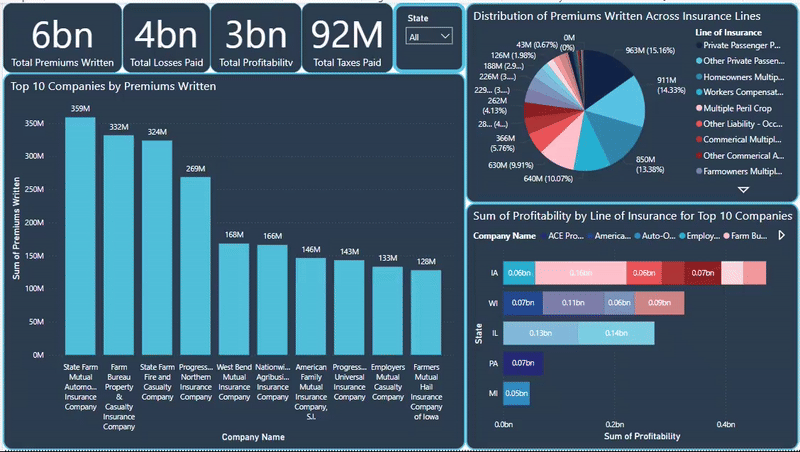

# Iowa P&C Insurance Analytics Dashboard

A Power BI dashboard analyzing Iowa's Property & Casualty Insurance market data from 2019-2023. The dashboard visualizes key metrics including premiums written, losses paid, and market distribution across different insurance lines and companies.

## Contact

If you have any feedback/are interested in collaborating, please reach out to me at  &nbsp; <a href="mailto:kvsvyas@gmail.com"> 

